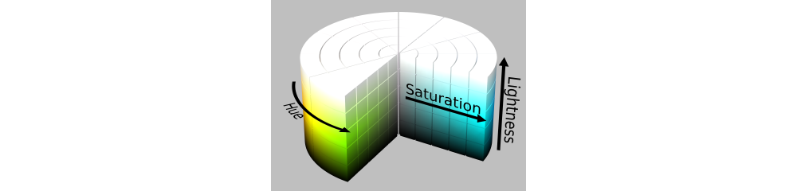
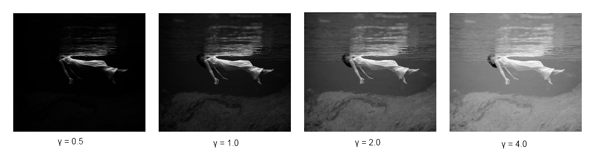

# Fractal Flame Coloring and Log Scaling
## Overview

The *chaos game* (**TODO: Link chaos game to the section describing it**) provides a way to plot whether points in the biunit square are members of the system or are not. However, the resulting image appears in black and white - lacking color or even shades of gray! The application of color as well as providing smoothed vibrant images are a their own process in the algorithm which deserves much text for several reasons:

1.	A flame is just simply not a flame without its structural coloring or if membership is binary (black and white) which results in a grainy image. Both of these shortcomings leave a lot to be desired but can be remedied.
2.	Much of the new *implementation* relys on reworking details on how coloring is done.

The previous section describing the flame algorithm (**TODO: Link to fractal flame section describing algorithm**) describes the application of log scaling, a scheme for structural coloring as well as certain color correction techniques however the implementation details were spared. They are expanded upon here in the context of the original fractal flame implementation : *flam3*. We present some of the inner algorithm choices, data structures, and capabilities that the program has. With that, in accordance to the challenge response style paper we present some of the difficulties with making improvements and transitioning the algorithm to the Graphics Processing Unit. Finally, we delve into our new *implenentation* and the differences, similarities, and any relevant backgroud information needed.

##Relevant Applied Color Theory and Imaging Techniques

###Introduction

In the case of the flame algorithm when we refer to coloring- we specifically mean tone mapping as well as color theory techniques (such as colorimetry) and imaging techniques (such as gamma correction). 

Luckily, theese techniques have strong mathematical backgrounds and there is a vast information about them readily available because of advances in both computer graphics and digital photography. 

Additionally, because the flame algorithm's output is an image or series of images we sometimes run into the same complications which plage digital photographs such as color clipping and therefore these same image correction techniques are translated over and retrofitted to greatly improve the visual.

We take a small detour and quickly visit all related techniques as one of the major requirements we must either adhere to these concepts or be able to achieve techniques that achieve comparable results.

###High Dynamic Range

A fundamental concept which the whole coloring and log scaling approach tries to achieve is a high-dynamic-range or simply abbreviated as **HDR**. High Dynamic Range  means that it allows a greater dynamic range of luminance between the lighest and darkest areas of an image.[1] Dynamic range is the ratio between the largest and smallest possible values of changeable quantity - in our case light.[2] Lastly, luminance is a measure of the intensity from the given light source per some unit area. (**TODO: Improve defintion**)[3]

The techniques that allow going from a lower dynamic range to a high dynamic range are collectively called high-dynamic-range imaging (HDRI). The reason we mention HDR and HDRI is because we are attempting to represent HDR flames while being constrained to Low Dynamic Range (LDR) viewing mediums such as computer monitors (LCD and CRT) as well as printers.[4]

*TODO:*
- Why are we constrained to  a low dynamic range? What makes a computer monitor or printer LDR or SDR?
- What can we do? There's gotta be a way to correct this! WE WANT TO VIEW OUR FLAMES ON OUR PRETTY LCD MONITOR AND WE WANT TO NOW!
- Alas,

The following techniques described below are not only for aethestics but also are some of the core techniques for represneting HDR images on LDR mediums. This coincides with the goal we wish to achieve and are paramount to fix our lDR dilemma. 

###Hue, Sautration, and Brightness (HSB) Color Model
To attempt to mathematically define color concepts we must first pick a model for which our colors will be represented.

- Let's pick HSB because that is what the flam3 uses.
- Cylindrical Coordinate Representations
- Describe what the cylinder represents in terms 
- Pros, Cons

All of the color definitions and concepts below will use the HSB model as their RGB color model. We wish to stress that there are alternative color models such as:

- Hue, Saturation, and Lightness (HSL)
- Hue, Saturation, and Intensity (HSI)
- and describe others

###Gamma and Gamma Correction

The term *gamma* refers to the amount of light that will be emitted from each pixel on the monitor in terms of in fraction of full power. By pixel we mean the red green and blue phosphors for CRT. (**TODO: Talk about LCDs. More relevant. I need a better understanding on gamma correction for LCDs to write about it) [5]

The main concept we're interested in is **gamma correction**. The reason we need *gamma correction* is the following:

1. CRT displays do not display the light proportional to the voltage given to each phosphor. Therefore the image does not appear in the way it was expected to be viewed.
2. **TODO:** Say something about why LCDs need gamma correction.
3. **TODO:** Say something about why printers can't map the whole color range.

To summarize, the RGB color system with red, green, and blue values ranging from 0 to 255 cannot be accurately represnted. We must perform some kind of correction in order to get the images we expect to see rather than actually see as output.

*TODO:** Talk about hardware implementations of gamma correction.
- Windows and Linux do not gamma correct(?)
- Mac OS X - Partial Gamm Correction(?)
- Now mention that this must be done at the software level.

**TODO: Formula confusion - elaborate later**

\begin{displaymath}
$b_{corrected} = b^{1/\gamma} 
\end{displaymath}

As seen above the gamma correction is a non-linear function whose graph looks like the follpwing:

Because we present 4 gamma values applied to an image. 

*TODO IMPORTANT:* Clear up gamma confusion. In the wiki article they define gamma as:

\begin{displaymath}
$v_{corrected} = v^{\gamma}
\end{displaymath}

Whereas Draves defines it as: 

\begin{displaymath}
$b_{corrected} = b^{1/\gamma}.
\end{displaymath}

Either correct the image text or the formula. But for now there's inconsistancies.

- Emphasize Image Preservation : highest and lowest colors
- Too little Gamma : What happens? (Right image)
- Just right (Third Image)
- Linear unfiltered Image : What's wrong? (Second Image)
- Too much Gamma: What happens? (First Image)

###Brightness and Brightness Correction

The term *brightness* refers to the intensity of the energy output of a visible source.  There are two common ways of representing it:

1.	Equal Weights of each color component (R, G, and B)
2.	Weighted values of each color component (R, G, and B) - refered to as perceived brightness (**TODO: Keep researching**)

Both the red, green, and blue components of a color have a different bell curve.

- A good brightness calculation attempts to model how the eye perceives color rather than treating them equal

All information was from here,
[http://whatis.techtarget.com/definition/0,,sid9_gci212262,00.html]

 ...

 There are many different methods for computing the brightness and percieved brigthness of a color. Many have flaws in them which either under or overrepresent one of the color components (R, G, or B).
 
-	In terms of HSV
-	How do R,G, B colors change when brightness changes?

Later, we will be interested in *brightness correction* - the act of adjusting the brightness.

- Too much brightness: What happens?
- Too little brightness : What happens?

###Saturation

The term *saturation* refers to ...

- Describe R, G, and B model as well as the stepness of the bell curve slope described here
- Hit on highly saturated colors appear more "pure" - define "pure"
- Hit on colors with little saturation appear "washed out"
[http://whatis.techtarget.com/definition/0,,sid9_gci212262,00.html]

- Touch on colorfulness, chroma, and saturation. Describe differences and confusion.
- How do you calculate how colorful something is? Describe common methods and  possibly equations
- Linear

###Vibrancy

The term *vibrancy* refers to ...

- Similar to Saturation
- Differences: Nonlinear
- How does it operate? Less saturated colors will get more of a saturation boost than colors that are already saturated.
Write between a paragraph or two desscribing this.

###Color Clipping

The term *color clipping* refers to ...

- What is it?
- How would an image fall outside min or max intensities?
- Problems: Loss of data. Values of densities above upper or lower bounds appear uniform.
- Possible remedies: Clip colors early to prevent this

##Log Transformation of Data

Data transformations in statistics are a common method of transforming data points in order to improve the interpretability of visualization of the graphs. Some common transformations include

- Square Root
- Logarithm
- Power Transform

We will apply these concepts to our histogram of points that the chaos game reproduces (**TODO:** See Flame Algorithm) The deterministic function which we will look at is that of the logarithm.

The ultimate goal again is preservation.If we plot a non transformed histogram of densities of a flame intact we loose information about the least and most dense areas of the histogram. The logarithm transformation helps perserve the relationship between points to provide a more accurate histogram.

*TODO:*
- Add Graphic
- Clean up

[http://en.wikipedia.org/wiki/Data_transformation_(statistics)]
 
##Tone Mapping

- Be general, we will later call back on this section to show that the flam3 algorithm is an adhoc implementation of tone mapping
- What is tone mapping?
- Why would we need it?
- Common methods
- but wait there's more...

##Flam3 : Original Coloring and Log Scaling Implementation

### Log Scaling of Chaos Game

- Recap that log transforming data is a plus
- What are we log transforming: points plotted by the chaos game
- What do we do with all these points? Image is still just shades of gray!

### Ad-Hoc Tone Mapping

- Why Ad-Hoc?
- Implementation, how to go from grayscale to color?
- Get detailed, very detailed! This will help when setting up new approach and comparing it

###The Palette

- R,G,B,Alpha
- Why Alpha? What does it do?

###Coloring Capabilities

####Overview

- Mention in our improved version we want to include a subset and if possible - all of the below features that make a flame- a flame.
- Now that we understand color theory and imaging techniques, what do they look like in the context of our flames?
- How are all of these implemented in the code?
- When in the code are these implemented? Be specific, include previous reference to the fractal flame section and try to 'point' at where this is happeneing

####Gamma 

- Provide illustrative examples
- Elaborate what happens when gamma is too high.
- Elaborate what happens when gamma is too low.

####Gamma Threshold

- What is this and how does it function?
- Why do we need this?
- Provide illustrative examples

####Brightness

- Provide illustrative examples
- Elaborate what happens when brightness is too high.
- Elaborate what happens when brightness is too low.

####Vibrancy

- Provide illustrative examples
- We have gamma and brightness... why do we need vibrancy too?

####Color Clipping

- Provide illustrative examples of color clipping in action and how it improves flame quality

####Highlight Power

- This is a specific feature and not a general technique (pretty sure)
- Explain the need for it
- Provide illustrative examples 
- Provide analysis
- Probably will *not* implement- only if there seems to be a need for it. 

#### All Together Now: The Coloring Formula

- Describe coloring formula, K1 and K2 in flam3
- What coloring correction and imaging technique features are in this formula?
- Where are other features applied?
- Should I explain the details how they are applied if there are applied in another section as that section will probably fail to mention them?

##Challenge

- Decent dynamic range
- Log-Scaled complications
	- Because we're using log scalled you will need exponentially more points in bright areas than dark areas which results in high quality images needing a whoppingly high number of iterations.

##New Approach

###Criteria

**TODO:** What we're looking for is reproduction of a flame that is approximately visually equivalant. 

###Tone-Mapping Operator

- Write about the new tone mapping operator implementation instead of log scaling and then coloring. 
- Possible Advantages : Hope to cut down on required points

###Implementation

- Detailed section that explains the gnitty gritty details of everything
- provide relevant background information
- Why? Why? Why? Provide detailed explanations for every step along the way? What was flam3 doing right? What could have been improved on?
- What are the pros and cons of the implementation we picked?

[1] http://en.wikipedia.org/wiki/High-dynamic-range_imaging
[2] http://en.wikipedia.org/wiki/Dynamic_range
[3] http://en.wikipedia.org/wiki/Luminance
[4] http://www.dpreview.com/learn/?/key=tonal+range
[5] http://www.colormatters.com/comput_gamma.html