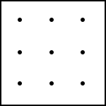
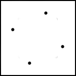
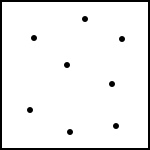
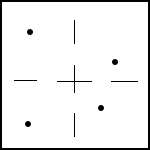

# Filtering

Image filtering is the process of enhancing an image so that inaccuracies in the
image can be corrected.  Sources of inaccuracies can be from bad sensor
measurements, extremely low or high data ranges, digital misrepresentations, and
many other sources.  These artifacts can be corrected by  Since image quality is
subjective due to human judgement, it may be difficult to determine a "best" 
filter.  However, by identifying the type of inaccuracies and choosing filters
suited to chosen criteria, the subjective nature of image enhancement can be
decreased such that the resulting images will be a clear improvement over the
original.

When rendering flames, there are two kinds of artifacts that need to be
minimized in order to create more visually attactive flames: aliasing and noise.
While these two problems and their solutions are related, we will need to
approach them with different techniques.  We will address both of these problems
and their solutions in more detail in the following sections.

## Aliasing

Aliasing is the effect of high frequency signals, in high resolution graphics,
being mapped and interpolated onto a lower resolution graphic such that the
smooth edges and gradients in the original image can not be represented
properly.  It is observable as distortion or artifacts on lines and smooth
curves.  Aliasing occurs when high resolution graphics are mapped to a lower 
resolution that cannot support the smooth gradients in the original graphic.

Graphic images are at the simplest level a collection of discrete color dots, or 
pixels, that are displayed on some graphic medium.  These pixels are generated, 
or rendered, from collections of data called fragments.  The data contained in a 
fragment can include texture, shader, color, Z location, and other data.  Each 
pixel is made up of one or more fragments, with each fragment representing a 
triangle.  Problems arise when the pixel is sampled from only one fragment in 
the pixel.  This causes all the other data from the other fragments to be loss 
and will result in an inaccurate image.

 

### Visual image information

In the continouos domain, or at resolutions tending toward infinity, we can
describe most flames perceptually as a collection of distinct (though often
overlapping) objects with smoothly curved outlines.  Our brains perform
object recognition all the time - it's hardwired into our visual system - so
it's natural that the most visually interesting flames are those which
stimulate traditional object recognition pathways in novel ways, rather
than, say, white noise.

2D object recognition in our brains depends on recognition of sharp
discontinuities in images (I have papers which you can cite to show this,
you don't even have to read 'em if you don't have time). Since so much of
our neural hardware depends on discontinuities at object boundaries, they
become important.

However, our algorithm runs in the discrete domain; ultimately the results
get sent to monitors. As a result, the perfect curves in the continuous
domain must be sampled along the 2D grid of pixels used in raster graphics.

### Spatial aliasing

In the flame algorithm, as described, each generated (x, y) point is rounded
to the nearest pixel, and then the color value is added to that pixel's
accumulator. Effectively, each pixel represents the average value of the
color function of the attractor across the area of that pixel. In other
words, we sample the color values of the flame once per pixel.

In 2D image space, this means any function with a higher spatial frequency
than a single pixel will be aliased by the sampling process. Image
discontinuities, such as object edges, are instantaneous, and therefore have
an infinite frequency response (though with finite total energy). As a
result, object edges are aliased in the spatial domain.

The result is stair-step jaggies in images (demo). Since our brain depends
so heavily on detecting object discontinuities for object recognition, these
artifacts are extremely noticeable, especially in motion.

The solution is to downfilter the highest spatial frequency components below
the sampling threshold. Unfortunately, downfiltering any image component,
especially surface textures, results in a reduction of detail across the
image. Our brains notice artifacts from aliasing at object borders, but also
notice reduced detail apart from those regions.

### Approaches to antialiasing

- Supersample antialiasing is the most trivial method to solving the aliasing 
  problem.  It is a relatively naive algorithm and works well but is expensive 
  in terms of resources.  Aliasing distortion occurs when continuous objects 
  cannot be represented correctly because of a relatively low sampling rate
  (resolution).  Supersampling solves this problem by rendering an image at a 
  higher resolution and performing downsampling, using multiple points to 
  calculate the value of a single pixel.  The sampling points lie within the 
  area of a pixel and their location is determined by the type of algorithm.
  The number of sampling points is directly related to the quality and 
  performance of the filter and is the biggest factor of cost in antialiasing.  
  Turning on 4x SSAA (4 samples per pixel) will require four times as many 
  samples to rendered, the fill rate will be four times longer and will have 1/4 
  the original frame-rate.
  
  The grid algorithm is the simplest and fastest - each pixel is evenly divided 
  into subsections with samples being taken at the center of each subsections.  
  However, because of the sample being extremely regular and lying directly on 
  the axis, the quality of this algorithm may suffer in certain cases.  The 
  rotated grid algorithm is a similar to the grid algorithm in that the pixel is 
  even divided into regular subsections, but with samples not lying directly on 
  the axis.  This algorithm is similar in performance to the regular grid 
  algorithm but with significantly improved filter quality.  Supersampling 
  algorithms exist that randomly chose sample locations and can produce better 
  quality images, but with a significant trade-off in performance.  (See Random, 
  Poisson, and Jitter algorithm depictions below).

  
  
  
  
  

- Multisample antialiasing, also known as full scene antialiasing, is a special 
case of supersampling where not all of the components of a pixel are 
supersampled.  This algorithm can achieve near supersampling quality at a much 
higher performance.  Pixels are generated using a collection of data called a 
fragments and may include raster position, depth, interpolated attributes, 
stencil, and alpha.  Multisampling algorithms select only a few components of a 
fragment to "supersample" so that some of that computational cost can be shared 
between samples.  Commonly, z-buffer, stencil, and/or color data is chosen to be
the fully supersampled components.

- Coverage antialiasing is a special case of multisample aliasing, and therefore 
  also a special case of supersample aliasing.  The algorithm has been designed 
  to further improve the performance of multisample antialiasing while keeping 
  quality as high as possible.  Multisample antialiasing will usually store only 
  one value for texture and shader samples for an entire pixel.  This is also 
  true for coverage antialiasing but we take it a step further and limit the 
  number of stored color and Z data samples.  Coverage antialiasing can store 
  more than a single value for the color and Z data, the point is to just hold 
  less than multisampling.  Usually, 4 or 8 color and Z data samples are used as 
  opposed to 8 and 16, respectively.  Holding more data constant allows for an 
  even smaller memory footprint and less bandwidth.

    Coverage sample points are boolean values that indicate whether or not a 
    sample is covered by a triangle in the pixel.  These samples are stored 
    usually stored as 4 bit data structures with 1 bit representing the boolean 
    value and with the other 3 bits used to index up to 8 color/Z values.  The 8 
    bytes required for 16 samples will be much less then the memory needed for the 
    color data so the extra overhead should be insignificant compared to the 
    bandwidth reduction.

- Morphological antialiasing is a significantly different antialiasing approach.  
  It does not rely on supersampling and is a completely post-process algorithm.  
  It works by blending colors after looking for and recognizing special pixel 
  patterns in an image.  The algorithm can be explained using the following 
  steps:
    1. Look for discontinuities in an image - We scan through all adjacent rows 
    and columns and store the lines where we find disconituity.  Edges of the 
    images are extended so that unnecessary blending does not occur around the 
    borders of the image.
    2. Identify special pixel patterns - We can through the list of 
    discontinuous edges and identify crossing orthogonal lines.  These locations 
    will mark an area for one of three predefined pixel patterns (Z-shaped 
    pattern, U-shaped pattern, L-shaped pattern).  See figures below for 
    depiction.
    3. Blend colors in pattern areas - The pixels that make make up the vertices 
    of the identified patterns are sampled and blended together.
  Notice that more samples do not have to be rendered when using morphological 
  antialiasing.  The computational resources required to do the above steps are 
  far less than the resources needed to render 4x, 8x, or 16x as many pixels.  
  Supersampling will generally produce slightly higher quality results but will 
  not be worth the performance trade-off, especially if real-time rendering is 
  needed.

- Window function
  A window function is a mathematical function that is zero-valued outside of 
  some chosen interval while manipulating the values inside that interval.  The 
  simplest window is the rectangular window.  It simply takes a chunk the 
  portion of the signal fitting inside in the window leaving discontinuities at 
  the edges (unless the signal is entirely within the limits of the window) [6].
  Filter shapes available in flam3 are the Guassian (default), Bell, Blackman, 
  Box, Bspline, Hamming, Hanning, Hermite, Mitchell, Quadratic, and Triangle 
  [8].

## Denoising

Image denoising algorithms is one of the most common and studied problems
in image processing.  Noise occurs as seemingly random, unwanted pixel 
inaccuracies as collected by the image source (commonly a camera, in our case,
approximating objects via random sampling).  Most image denoising algorithms
deal with this problem by treating noise the same as small details and then by
removing all the small details with some form of blurring.

Antialiasing deals with the problems caused by approximating objects via
sampling along a regular 2D grid. Denoising, by contrast, deals with the
problems caused by approximating objects via random sampling.

A "regular random grid"? Isn't that an oxymoron? No, they're really two
separate things: first, we use random sampling to approximate the IFS with
Monte Carlo methods, then we use grid sampling to approximate the histogram
of those samples' positions.  Two separate sources of error, two separate
strategies to deal with it.

### The origins of noise

Sampling noise from Monte Carlo IFS estimation arises from two main sources:
coverage limitations and accuracy errors.

- Because we don't know the shape of the attractor analytically, we can't
  sample it directly; we must follow it along the IFS. This means that the
  IFS will jump around from location to location within the image in a
  generally unpredictable pattern. Because of this jumping, any errors in
  the image show up as point noise, rather than along contours as with
  aliasing.

- Again, since we don't know the shape of the attractor, we choose random
  points to start with. After picking a new random point, a thread runs a
  few iterations without recording any data so that the point can join the
  main body of the attractor. However, this number may sometimes be
  insufficient, leading to random points placed "outside" the attractor.
  Floating-point precision errors can similarly reduce the accuracy of
  generated points.

### Visibility

Both of these sources of error have something in common, though: they show
up a lot more in darker image regions. The image is log-filtered, meaning
the brightest image regions are covered by hundreds or even thousands of
times more samples than the darkest. In many images,
contrast-brightness-gamma settings cause extreme sensitivity in dark
regions, so that a single sample in the middle of an otherwise-black image
region causes a jump of, say, 5% of the total luminance scale of the final
image. This is noticeable.

When we say "dark", we mean pre-log-filtering. Since FLAM3 does color
clamping, it's not uncommon to produce images where most of the energy lies
outside of the final representable intensity scale. In those images, even
mid-level tones have relatively few samples, and have visible point noise.

### Denoising a flame

To combat this, FLAM3 does density estimation filtering. Within dark regions
of the image, it applies a wider kernel, or a smaller blur. ...

Problems: difficult to accelerate on GPU; usually requires hand tuning; it's
"just another blur" which can reduce image details and textures. 

- Kernel Estimator
  Besides for the histogram, the kernel estimator is probably the most commonly 
  used and studied density estimator [4].  It is a non-parametric way of 
  estimating the probability density function of a random variable.  Kernel 
  density estimation is a fundamental data smoothing problem where inferences 
  about the population are made, based on a finite data sample [5].

- Adaptive Density Estimation Filter
  The adaptive density estimation filter used by FLAM3 is a simplified algorithm
  of the methods presented in Adaptive Filtering for Progressive Monte Carlo 
  Image Rendering [CITE].  The algorithm creates a 2 dimensional histogram with 
  each pixel representing a bin.  For each sample located in the spatial area 
  of a pixel, the value for that bin is incremented.  Kernel estimation is then 
  used to blur the image, with the size of the kernel being related to the 
  number of iterations in a bin.  Lower number of iterations in a bin (low 
  sample density areas) lead to larger kernel sizes and increased blurring.  
  Higher number of interations in a bin (high sample density areas) lead to 
  smaller kernel sizes and decreased blurring.  Specifically, the kernel width 
  can be determined by the following relationship:
  
    KernelWidth = MaxKernelRadius / (Density^Alpha) [CITE]
    
  The MaxKernelRadius and Alpha values are determined by the user as they are 
  properties of the flame.  MaxKernelRadius tells the algorithm the maximum 
  width that the kernel can be and the Alpha value determines the estimator 
  curve to use.  The ability to adjust the width of the kernel according to 
  how many samples there are spatially increases the quality of the image by 
  limiting the blur in the more accurate areas with higher sample density.

- Gaussian Convolution
  Gaussian convolution filtering is a weighted average of the intensity of the 
  adjacent positions with a weight decreasing with the spatial distance to the 
  center position p.  The strength of the influence depends on the spatial 
  distance between the pixels and not their values.  For instance, a bright 
  pixel has a strong influence over an adjacent dark pixel although these two 
  pixel values are quite different.  As a result, image edges are blurred 
  because pixels across discontinuities are averaged together [7].

- Bilateral filter
  The bilateral filter is also defined as a weighted average of nearby pixels, 
  in a manner very similar to the Gaussian convolution filter described above.  
  The difference i s that the bilateral filter takes into account the difference
  in value with the neighbors to preserve edges while smoothing.  The key idea 
  of the bilateral filter is that for a pixel to influence another pixel, it 
  should not only occupy a nearby location but also have a similar value.

  The bilateral filter is controlled by two parameters: σs and σr.  Increasing 
  the spatial parameter,  σs, smooths larger features.  Increasing the range 
  parameter,  σr, makes the filter approximate the Gaussian convolution filter 
  more closely.  An important characteristic of this filter is that the 
  parameter weights are multiplied; no smoothing will occur with either of these 
  parameters being near zero [7].

  Iterations can be used to generate smoother images similar to increasing the 
  range parameter, except for being able to preserve strong edges.  Iterating 
  tends to remove the weaker details in a signal or image and is desirable for 
  applications such as stylization that seek to abstract away the small details.
  Computational photography techniques tend to use a single iteration to be 
  closer to the original image content [7].

- KD-Trees

- Permutohedral Lattice
