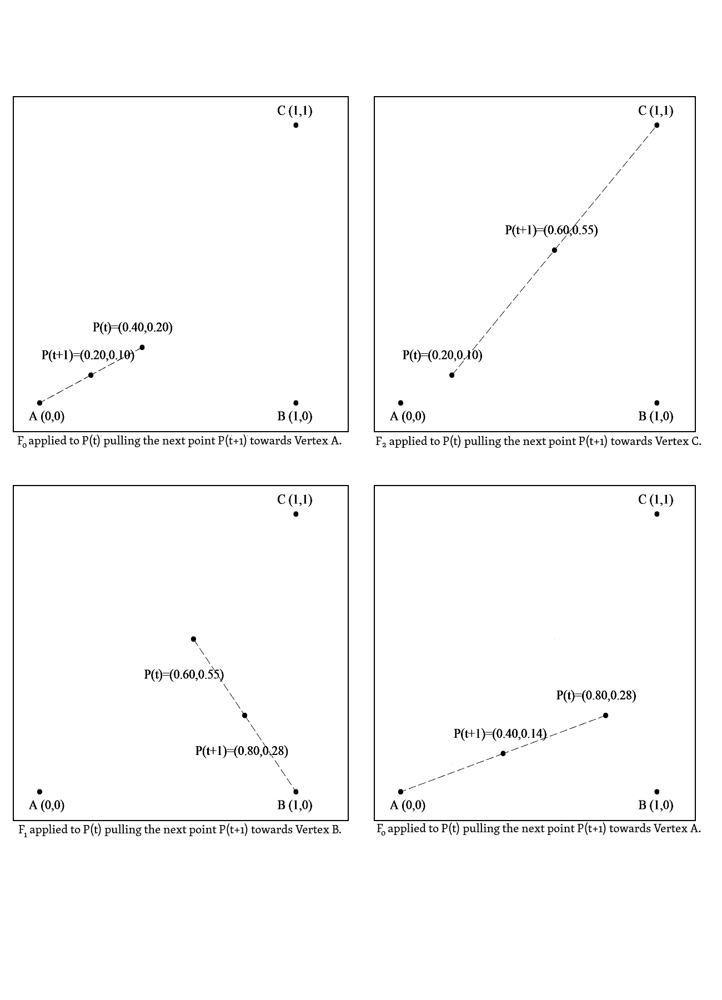
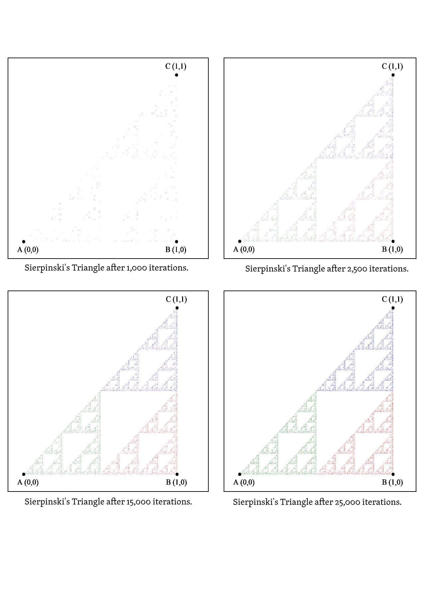

#Fractal Flame Algorithm and Prior Work Section

##Section Outline
This section provides an in-depth description of the flame algorithm along with a primer on the Iterated Function System (IFS) in which the Flame Algorithm is a variant of. We provide this primer to the reader in order to solidify the concept of the chaos game which is essential to understanding the flame algorithm because it builds heavily on upon the concepts used in the classical IFS. 

Also included in this section is a comprehensive history of the Flame algorithm from its birth in 1992 into the present day. This includes any new theoretical as well as empirical research (such as software implementations). Given our goals of implementing a heavily optimized version of the Fractal Flame Algorithm for the GPU we felt it was prudent to dissect a handful of previous implementations to examine design decisions, inner-algorithmic choices (e.g. filtering, tone-mapping, etc.), and possible bottlenecks that occur because of design decisions. These findings are presented below and are pivotal in providing a basis for comparison and understanding of what areas of optimization of the Fractal Flame Algorithm remain unexplored.

Finally, we end with a concluding section summarizing our current knowledge on the topic and describe how it influenced our proposed implementation for rendering fractal flames using the flame algorithm which is described in the following section.

##Iterated Function System (IFS) Primer
This primer aims to present the fundamental concepts of iterated function systems along with several classic examples that will visually and mathematically convey two important concepts:

1. The importance of random application of defined affine transformations on a random starting point in the plane
2. How affine transformations are used to transform (rotation, scaling, or shear) and transform points to produce self-similar images such as the Sierpinski Triangle and Baransley Fern.

These concepts are the building blocks of the flame algorithm. If the reader is already familiar with the concept of iterated function systems feel free to skip over this section and start reading how fractal flames differ from the classical iterated function system that is described below. 

###Definition
An **Iterated Function System** is defined as a finite set of **affine contraction transformations** (Fi where i=1,2, ... N)(1, 3) that map a **metric space** onto itself. Mathematically this is:

![Definition of an Iterated Function System[1]](./flame/ifs_equation.png)

A **metric space** is any space whose elements are points, and between any two of which a non-negative real number can be defined as the distance between the points - an example is Euclidean space.[2]

An **affine transformation** from one vector space to another comprises a linear transformed (rotation, scaling, or shear) following by a translation. Mathematically this is:

![Definition of an Affine Transformation [3]](./flame/affine_transform_equation.png)

These transforms can be represented in one of two ways:

1.	By applying matrix multiplication (which is the linear transform) and then performing vector addition (which represents the translations).

==============

** TODO: Add Example

==============

2.	By using a transformation matrix. To do this we must use homogeneous coordinates. Homogenous coordinates have the property that preserves the coordinates in which the point refers even if the point is scaled. By using the transformation matrix we can represent the coefficients as matrix elements and combine multiple transformation steps by multiplying the matrices. This has the same effect as multiplying each point by each transform in the sequence. This effectively cuts down the number of multiplications needed- this is worth noting as it will be utilized in our implementation.

==============

** TODO: Add Example

** Provide graphic such as : http://people.gnome.org/~mathieu/libart/libart-affine-transformation-matrices.html **

==============

3. The term **contraction mapping** in plain English refers to a mapping which maps two points closer together. The distance between these points is uniformly shrunk. This contraction will be seen when performing the classic Sierpinski Triangle problem.[4] The properties above can be proved by the Contraction Mapping Theorem and because of this proves the convergence of the linear iterated function systems we present in this section.

###Chaos Game
The most common way of constructing an Iterated Function System is referred to as the *chaos game* as coined by Michael Barnsley. Our initial fractal flame algorithm will also use this approach. In the *chaos game* a random point on the plane (in our case between -1 and 1) is selected. Next, one of the affine transformations to describe the system is then applied to this point and the new resulting point is then plotted and the procedure repeats. Selection of the affine transformation to apply is either random (in the case of Sierpinski's triangle) or probabilistic (in the case of Barnsley's Fern). The procedure is repeated for N iterations where N is left up to the user. The more iterations you allow the chaos game to run for the more closely your resulting image resembles the iterated function system.

Again, this procedure in pseudocode is as follows:

###Classical IFS Example : Sierpinski Triangle 
We will start with the illustrative example of Sierpinski's Triangle. This example is suitable to show how the fractal will begin to show itself with a certain number of iterations. We will also observe the contractive nature of the affine transformations.

To construct the Sierpinski Triangle using the Chaos Game we need to describe the affine transformations that will be used. Using the most basic version of an affine transformation described in variation 1, we can describe the system with the following 3 transformations:

However, using the affine transformation matrix described in we can equivalently write the transformations as:

Each of these transformations pulls the current point halfway between one of the vertices of the triangle and the current point. F0 performs scaling only. F1 and F2 perform scaling and translation.

We now begin the *chaos game*. We first select a random point on the biunit square. In this case we have pseudorandomly selected x = 0.40 and y = 0.20. We then pseudorandomly pick transformations. The first three transformations shown are F0, F2, and then F1. These are shown below.

Notice how the next point is the midpoint between the Vertex and current point. These mappings guarantee the convergence of the algorithm to the desired IFS. This process continues on with each point being plotted. We have provided coloring for a visual representation of what transformation was responsible for each point. Points transformed by F0 are labeled yellow, F1 are labeled Red, F2 are labeled Blue. Iterations 2,500, 10,000, and 25,000 are displayed:

The more one stochastically samples, the closer the output image is to the solution of the Iterated Function System being computed. 

###Classical IFS Example : Barnsley's Fern 

=========

*TODO: Do I even need this ?*

=========

##Fractal Flame Algorithm

###Differences from Classical Iterated Function System (IFS)

Fractal flames are a member of the Iterated Function System however differ from Classical Iterated Function Systems in three major respects[5]:

1.	Instead of affine transformations presented in the previous section nonlinear functions are used.
2.	Log-density display is used instead of linear or binary. 
3.	Structural Coloring
On top of the core differences, additional pyschovisual techniques such as spatial filtering and temporal filtering (motion blur) give rise to more aesthetically pleasing images with the illusion of motion.  

###History 

- Under Construction
- Scott Draves, give background on his studies in meta level programming, and background as an artist interested in process rather specific art creation.
- Algorithm birth year, mention in a sentence or two what computing was like back then. Obviously not the age of highly parallel computing!
- Perhaps, mention electric sheep again.

###Algorithm 

####Outline
The details of the algorithm as well as procedural psuedocode will be described below but will spare full-scale explanations for a specific reason: these will be saved for their own respective chapter in which we review the existing implementation and then present the improved implementation. We do this merely to partition the large sections of the paper and to bring attention to the relevant new approaches that will be described.

The following will give a coherent understanding of the algorithm minus the implementation details.

####Transforms
Unlike the classical IFS examples presented previously which apply one transformation to a set of points, the fractal flame applies multiple transformations. These transformations can be nonlinear unlike their classical IFS counterparts. Additionally not all mappings are contraction mappings[5] however the whole system is contractive on average. There are some fractal flame systems which are degenerate and are not contractive - however these are of no interest to us.

The multiple variations as well as their order of application on the initial point choosen at random are described below:

1.	**Affine Transformation - Under construction**

The affine transformation we will be working with for the flame algorithm is of the form:

**TODO: Graphic of formula:**  x' = x * a + y * b + c
**TODO: Graphic of formula:**  y' = x * d + y * e + f

Again, this transformation makes it possible to provide rotation, scaling, and sheer to the points. The information that is represented in this form is both space (x and y coordinates) as well as color - which will be expanded upon over the next sections.

2.	**Variation - Under construction**

To provide the complex realm of shapes the algorithm can produce we introduce a non-linear functions called variations.

The affine transformed point is further applied to the variation resulting in the transformation being of this form:

**TODO: Graphic of formula:** Fi(x,y) = Vj(aix + biy + ci, dix + eiy + fi)

Furthermore, multiple variations can be applied to an affine transformed point. Each point also is multiplied by a blending coefficient named vij which controls the intensity of the variation being applied. The expanding formula is the following:

**TODO: Graphic of formula:** Fi(x,y) = sum ( ... )

By applying variations, the resulting solution is changed in a particular way. Fundamentally there are 3 different types of variations in which can be applied. These are either: Simple Remappings, Dependent Variations, or Parametric Variations

**Simple Remappings:** TODO - Write a sentence about what it is.

**Dependent Variations:** TODO - Write a sentence about what it is.

**Parametric Variations:** TODO - Write a sentence about what it is.

For a visual supplement as well as an extensive collection of many catalogued variations please refer to the Appendeix of the original Flame Algorithm Paper.

3. **Post Transformation - Under construction**

After applying the variations which shape the characteristics of the system we apply what is known as a post transform which allows the coordinate system to be altered. This is done with another affine transformtion labeled Pi. By adding to our previous definition the definition for all of the collective transformations is:

**TODO: Graphic of formula:** 

where Pi is equal to:

**TODO: Graphic of formula:**  Pi(x,y) = ...

4. **Final Transformation - Under construction**

Finally, because the image is eventually outputted to the user we apply the last transformation in which we applying a non-linear transformation

Note: isn't applied directly to the computational loop - merely for visual output
Non-linear camera

####Log-Density Display of Plotted Points

In the classical Iterated Function System, described previously, points were either members in the set or not. For every subsequent time the chaos game selected a point that was already shown to have membership in the set we actually lost information about the density of the points. To remedy this for the fractal flame algorithm we instead use a histogram for plotting points in the chaos game. Given that points are now plotted onto the histogram we have several different methods we could go about plotting them into a resulting image which include:

1. **Binary Mapping:** As described before, this did result in the images we wished to produce but were not smooth and contained no shades of gray- only black and white. 

2. **Linear Mapping:** A linear mapping of the histogram provides an improvement but the range of data is lost in the process. The linear mapping has problems differentiating large scales of range. For example, a point plotted 1 time, 50 times, and 5000 times would be a great illustrative example. Compared a point of density 5000 both point densities 1 and 50 appear to be of relatively same magnitude however there is a great different in them.
 
3. **Logarithmic Mapping:** This mapping proves to be superior to it's counterparts. The logarithmic function allows a great range of densities relationship to oneanother to be persered. This is the type of mapping the flame algorithm employs. 

============

**TODO: Pictorial Examples**

============

As a note to avoid confusion, the logarithmic mapping allows the image to now displayed in shades of grays and not as the vibrant colorful flames readily available to be viewed on flame gallery websites. Structural coloring, color correction and enhancement techniques, and tone mapping take care of these and are all seperate algorithmic processes.

####Coloring (Tone Mapping) and Gamma Correction
Under Construction
 
============

**TODO: Write section**

============

Please refer to Chapter **X** for more detailed explaination covering the following:

-	Original Implementation Details
-	Color Correction Features
-	Improved Implementation Details

####Symmetry - Under Construction
Under Construction
  
============

**TODO: Write section**

============

####Filtering 
Under Construction
  
============

**TODO: Write section**

============

Please refer to Chapter **X** for more detailed explaination covering the following:

-	Original Implementation Details
-	Filtering background
-	Other Filtering Approaches
-	Improved Approach

####Motion Blur
Under Construction
 
============

**TODO: Write section**

============

####Procedure
Under Construction
 
======

*TODO : Provide graphic of psuedocode / procedure

======

[1] http://en.wikipedia.org/wiki/Iterated_function_system

[2] http://en.wiktionary.org/wiki/metric_space

[3] http://en.wikipedia.org/wiki/Affine_transformation

[4] http://www.maplesoft.com/support/help/AddOns/view.aspx?path=Definition/contraction

[5] Draves, Scott; Erik Reckase (July 2007). "The Fractal Flame Algorithm" (pdf). Retrieved 2008-07-17.