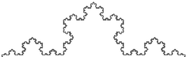
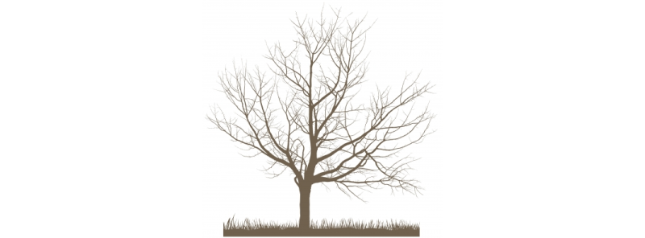
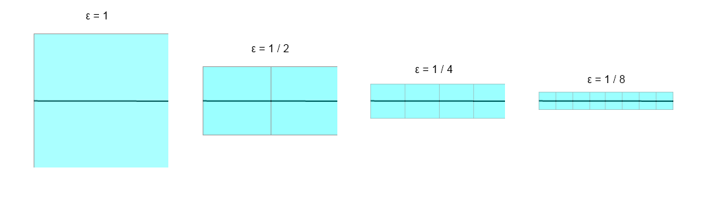
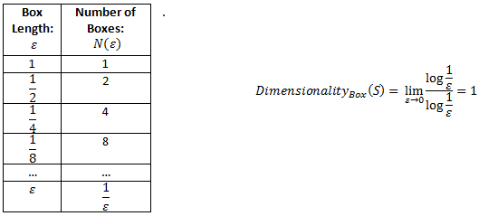
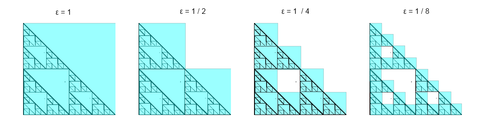
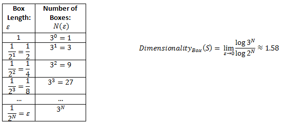
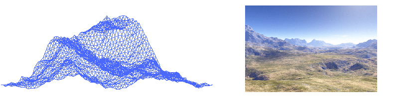

#Fractal Background
##Purpose of Section

The fractal flame algorithm draws upon concepts across many fields including: statistics, mathematics, fractal geometry, the philosophy of art and aesthetics, computer graphics, computer science, and others. One may become short of breathe just trying to read that entire sentence on one breathe of air.  The point we wish to make is the fractal flame algorithm is arguably the most complex fractal process to date. The road ahead of us for not only optimizing but fundamentally changing the process for how fractal flames are rendered is not so clear and will require a solid knowledge as well as innovation.

The innovation is what the majority of this paper is about and as a guiding rule we let the words of Sir Francis Bacon lead us: *"When you wish to achieve results that have not been achieved before, it is an unwise fancy to think that they can be achieved by using methods that have been used before."*

As unwise as it would be to assume our solution to our design problem has already been solved, it would also be unwise not to draw from previous knowledge from the aforementioned fields. Therefore knowledge from the mathematical, statistical, and ideas routed in the field of computer graphics will be supplemented as needed when we present design decisions later in the paper.

Before we get into our innovation, we do wish to present ample background information on two fields of which warrant attention: fractal geometry and the aesthetic nature of fractal geometry. We justify our presentation of fractal geometry as the mathematics behind it is not blatantly intuitive and key concepts cannot be hand waved later in this paper. Had the famous equation $z_{n+1} = z^2_n + C$ been intuitive then we would be able to visualize without the aid of computer graphics it as the Mandelbrot Set and understand its ability to scale infinitely without degradation.

We will touch on these intriguing and sometimes counterintuitive fractal properties and also address their relevance in our project and what limitations they pose upon us for our approach. We also will explain the different types of fractals and how fractal flames, a variant of the iterated function system, vary from the Mandelbrot set shown above. Unlike classical geometry, fractal geometry is a rather new field of geometry and we believe presenting a comprehensive knowledge of the field in context of our new approach is absolutely feasible.

The next area we wish to articulate is an atypical one: the aesthetical nature of fractal geometry. As computer scientists, beauty is something that we have struggled to universally define and often allude to the idiom: *"Beauty is in the eye of the beholder."* Besides perhaps art therapy and for visual appeal, flame fractals do not have an immediate real life application and therefore much of the justification for developing a GPU Fractal Flame Render lies upon their aesthetics, the idea of creating a process which allows artistic formation, and the wonder they bring. We spare excruciating detail but show major milestones in history dating back to African civilizations who built their culture and art around self-similar repeating geometric figures. We wish to make the point of the universal attraction towards to these shapes regardless of society or background as well as where the history of fractals are headed.

After understanding the background behind fractal aesthetics we will later apply this knowledge and present computer imaging techniques to show how techniques such as gamma correction, filtering, motion blur, symmetry, the chaos game, and log-density are important to visually preserve the fractals we wish to render.

##Origins: Euclidean Geometry vs. Fractal Geometry

Geometry formalizes the way we talk about and perceive points, shapes of figures, and the properties of space. Up until the 19th century geometry need not be prefixed with the specific type of geometry that it was referring to- it was assumed it was Euclidean named after Euclid the Greek mathematician of Alexandria, Egypt.  While teaching at the Alexandria Library, Euclid had transcribed a comprehensive set of 13 books in which he titled Elements. These books described Euclidean Geometry (and other topics) and included his own work along with other mathematicians including Thales, Pythagoras, Plato, Eudoxus, Aristotle, Menaechmus, and other predecessors.

Element's impact was dramatic. So much so that Euclid is often referred to as the "Father of Geometry". By the 20th century it was being taught globally in schools. Shapes such as: circles, triangles, and polygons are taught at an early age.

However as influential as the idea of Euclidean Geometry are its ideal shapes failed to describe the shapes that appear in nature. As stated in the opening paragraph of Benoit Mandelbrot's book, The Fractal Geometry of Nature: "Clouds are not spheres, mountains are not cones, and lightning does not travel in a straight line. The complexity of nature's shapes differs in kind, not merely degree, from that of the shapes of ordinary geometry."[1]

##Fractal Geometry and Its Properties

This new geometry Benoit Mandelbrot writes about in his book, he calls fractals which come from the Latin work fractus meaning "fractured".  These new shapes exhibited different properties than classical Euclidean shapes. These shapes were rough and did not belong to an integer valued dimension. Fractals also exhibited self-similarity in which parts of the figure repeat themselves. The images did not degrade with scale either like other classical shapes or like a photograph.
These new shapes had been investigated in the Western World previous to Mandelbrot and were already an accepted part of African art and culture before Mandelbrot had been observed and published his findings which lead to their widespread use and acceptance.

We summarize the properties in which Mandelbrot and his predecessors have found. We will freely reference these properties from this point forward when we need to draw upon knowledge.

###Self Similarity

Fractals contain the property of self-similarity. This self-similarity is classified into different types: ranging from the strongest form labeled exact self-similarity to the weakest form called statistical or approximate self-similarity. The three classifications are below:

**Exact Self-Similarity:** This type of self-similarity contains, as its name implies, exact copies of itself repeating at infinitely smaller scales. Classical examples include Sierpinski's gasket or the Koch Curve.

**Quasi Self-Similarity:** This type of self-similarity does not contain exact copies but rather distorted or degenerate forms of itself at infinitely smaller scales. Classical examples include the Mandelbrot set.

**Statistical Self-Similarity:** This type of self-similarity is the weakest and is the type we encounter the most often in the real world. Statistical self-similarity refers to the fact that the object has numerical or statistical measurements that are maintained at different scales. When classifying shapes in nature as fractal-like we are referring to this definition. For example, the self-similar aspects of how a tree branches are never found to be exact and sometimes deviate from their expected pattern. We use this definition to account for this. We do not have the luxury of always talking about things in the ideal world.
Another classical example is measuring a coastline such as Britain. When scaling the coastline it appears similar to at magnified scales. Additionally, what follows from this is the more accurately we measure the coastline (with a smaller base measurement) the more the length increases. This length increases without limit and contrary to intuition shows that the coastline of a country is infinite.

###Fractal Dimensionality

Classical dimensionality is often expressed in whole number integer values. Lines have a dimensionality of 1, squares have a dimensionality of 2, and cubes have a dimensionality of 3. This however does not explain how completely a fractal fills a space. Does the Sierpinski's triangle cover 1 dimension like a line or 2 dimensions like a triangle? The answer is actually that it contains a dimension that is between the two!

We can do this using a variety of ways that formally define fractal dimensionality including: Hausdorff dimension, R[e']nyi dimension, and packing dimension. These theoretical definitions differ in their approach however all three attempts to explain the same phenomenon: real numbered dimensionality.

We will explain fractal dimensionality in an intuitive way rather than provide a heavy mathematical explanation. We will do this using the concept of a box-counting dimension which lends itself to ideas from the R[e']nyi dimension.

To calculate the dimensionality of an object, we first superimpose an equidistant grid on the object and count the number of boxes that is necessary to cover the object. Next, we refine the grid by decreasing the size of the grid and repeat the process. We use

\begin{displaymath}
    \text{Dimensionality}_{box}(S) =
    \lim_{\varepsilon \to 0}
        \frac{\log N(\varepsilon)}{\log \frac{1}{\varepsilon}}
\end{displaymath}

where $N(\varepsilon)$ is the number of boxes needed to cover the set, $\varepsilon$ is the side length of each box, and $S$ is the set we wish to cover.

For a line with a known dimensionality of 1 we perform the box counting procedure. We will start with a side length of length 1 and continually half it until a pattern emerges.

We can solve the Box Counting equation by completing the pattern to solve what the pattern is as the side length approaches 0. This analysis is below:

Now we show a fractal dimension. We will use Sierpinski's gasket as our example. We again start with side length of 1 and continually half it until a pattern emerges.

We rewrite our results in the form of powers and show the pattern.

We call this dimensionality- **roughness** which measures its irregularity.

==========

**TODO : Explain why fractal dimension is important to us for this project**

==========

###Formation by Iteration

The method for constructing a fractal relies on an iterative process. Regardless if  the fractal is a naturally occurring statistically self-similar fractal, a computer generated fractal, or even a mathematical calculation of a set that exhibits fractal-like properties they all rely on a process which involves multiple iterations of a specific process. This process could be for example in geometric fractals- scaling shapes or in the case of algebraic computer generated fractals - adjusting parameter values.

##Fractal Types
When one gets their first taste of fractal-geometry they notice the diversity of shapes and figures that encompass it. For our purposes, we will not classify the geometric figures by how they look but rather the process for creating them. We do this because given the nature of this project because we are focusing on the computational and algorithmic implementation of the fractal - the shape that it produces is secondary. It is not always apparent which creation method was used to create a certain pattern. By classifying fractals by their creation method, we can do the following:

1. Explain what this project is not
2. Draw similarities from closely related fractal systems
3. Compare the bottlenecks and difficulties between systems. The major classifications of fractals by their generation methods are the 4 types presented in the following subsections.

###Escape Time Fractals

This type of fractal relies on recursively applying an equation upon an initial point. The transformed point can either diverge past a certain bounds, set by the programmer, which is the escape circumstance or can never reach the escape circumstance. Different points reach the escape circumstance at different rates.

Output images of these images can be black and white denoting which points did not escape and which points did escape. This however is too simplistic and does not produce as visually appealing image as coloring the points depending on how fast each point escaped.

Classical examples of fractals include:

-	Julia Set
-	Mandelbrot Set
-	Orbital Flowers

and many others.

###Strange Attractors

Strange attractors are attractors whose final attractor set are that of a fractal dimension. An attractor is a set that a dynamical system approaches as it evolves. Dynamical systems are systems which describe the state of the system at any instant and contain a rule that specifies the future state of system. A difference of the strange attractor versus a traditional attractor is that strange attractors have a sensitive dependence on their initial conditions and often exhibit properties of chaos which makes their behavior hard to predict. When we refer to properties of chaos we mean that a point which is close to the attractor will become separated at an exponential rate.

###Random Fractals
Random fractal's iterative process relies on a non-deterministic process for creation (instead of a deterministic one seen above). By applying some process the resulting set or image exhibits fractal-like properties. Many landscapes and plants in nature exhibit this property. For example, mountains are not formed by a deterministic process yet exhibit statistical self-similarity. Fractal landscape generation is a stochastic process which tries to mimic this stochastic process in nature.

###Iterated Function Systems
This is the fractal system that our project will focus upon. Iterated function systems rely on performing a series of transformations which are generally contractive on average[2] stochastically to produce the output image. This stochastic process is called the **chaos game**. The chaos game starts with randomly choosing an initial point and then consecutively applying a randomly chosen transformation from the entire set of transformations that make up the iterated function system.

The entire iterated function system process and its intricacies will be articulated upon in the next section.

##Visual Appeal
The visual appeal of fractal geometry is far reaching and includes groups of people such as certain African societies, individuals who appreciate the fractal aspects of nature, and online fractal art communities such as Electric Sheep. Its universal appeal is of course subjective like any other art process.

First and foremost, nature has is the most apparent in creating fractal-like features which we can readily observe. Examples are plentiful and include- the leaves of ferns and other plants, tree branching, mountain landscapes, certain intricate rivers, river erosion patterns, coastlines, electrical discharge patterns, romanesco- a broccoli-like plant,  hydrothermal springs, cloud-spiral formations, virus and bacterial colonies, coastlines, and numerous others. [3] The wonder that nature brings individuals can partly be attributed to the idea of self-similarity and the complex shapes it produces.

Fractal Geometry has been a part of the African Culture, social hierarchy, and art predating any formal western knowledge on fractals. Village architecture, jewelry, and even religious rituals all exhibited the concepts of self-similarity - with features repeating on smaller scales. [4]

Recently with the aid of computer aided image generation, the appreciation of fractals has spread to a wider community. For example, the application Electric Sheep uses distributed computing in order to evolve fractal flames which are displayed as screensavers to users. The community has membership of roughly 500,000 unique members[5] who appreciate viewing fractal flame images.

We hope that this background information shows the general interest in fractal-like patterns and with that our project focuses on this last group of individuals who appreciate computer generated fractal images. Our GPU rendered fractal algorithm hopes to deliver the existing community with the opportunity to continue viewing these fractal flame images without the need for distributed computing to render them in real time- a major improvement.

##Limitations of Classical Fractal Algorithms
The purpose of this section is to explain the shortcomings of existing fractal methods, along with their coloring techniques, ability to display fractal motion:

- What limitations do classical fractals impose?
- Why can their fractal structures not display vibrant colors?
- Why can classical fractal methods not display intricate fractal motion?

** TODO: Revise citations in correct format and put in Acknowledgements section **

[1] Brickmann, J. (1985), B. Mandelbrot: The Fractal Geometry of Nature, Freeman and Co., San Francisco 1982. 460 Seiten, Preis

[2] Draves, Scott; Erik Reckase (July 2007). "The Fractal Flame Algorithm" (pdf). Retrieved 2008-07-17.

[3] http://www.miqel.com/fractals_math_patterns/visual-math-natural-fractals.html

[4] http://www.ted.com/talks/ron_eglash_on_african_fractals.html

[5] http://www.triangulationblog.com/2011/01/scott-draves.html
