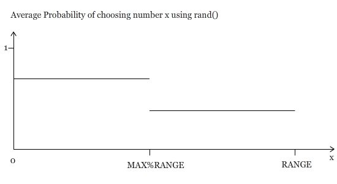

# Random Numbers and Pseudo-Random Number Generators

Random numbers are used in this project because of their importance in
calculating and rendering fractals using Iterated Function Systems. For
example, in order to recreate Sierpinski’s triangle, one defines the three
vertex points A, B and C. Starting at point A, one randomly picks the next
point (B or C) and draws a point halfway between the points chosen. From there
it is all about picking the next point randomly and doing the same thing all
over again thousands of times until getting a fractal like that in picture R.1.

Real random numbers are hard to calculate in a computer; in great part because
they depend on time or because there isn’t an infinite number of bit sized
chunks for computation. Pseudo-Random Number Generators (PRNGs) are algorithms
implemented in order to simulate randomness in a computer and like many
things; different algorithms have advantages and disadvantages that we will
consider in this section.

## `rand()` and Linear Congruential Generators

We begin the search for pseudo-random number generators with the commonly used
system-supplied `rand()` function. The problem with this function is that its
randomness is biased.

If we say `x=rand()%RANGE;` the function returns any number represented by [0,
RANGE) instead of [0,RANGE]. Assuming that `rand()` outputs a number [0, MAX],
RANGE should be able to divide by MAX+1 entirely in an ideal PRNG, however it
doesn’t in the rand() function and therefore the probability of choosing a
random number X in [(MAX%RANGE), RANGE] is less than that of choosing it in
[0, MAX%RANGE] as shown in picture R.1.1.

## ISAAC

An alternative that sounds like a better choice is ISAAC, it stands for
Indirection, Shift, Accumulate, Add, and Count [2]. The way it works is by
using an array of 256 4-byte integers which it transforms by using the
instructions that define its name and places the results in another array of
the same size. As soon as it finishes the last number, it uses that array to
do the same process again. The advantages of this PRNG is that it is fast
since it only takes 19 for each 32-bit output word. The disqualifying
disadvantage is that GPUs (which we will use for this project) don’t have the
memory required to be able to have arrays of size 256.

## Mersenne Twister

This PRNG is a good choice for this project for several reasons; it is
sufficiently fast for this project, it has a period of 2^19937 -1  (meaning
the random numbers will not repeat for that many iterations), and it can be
implemented on a GPU, however, it requires a large amount of state on the
GPU, and it operates in batch mode, meaning that when the pool[^1] runs out of
random bits, the entire pool must be regenerated at once. This *can* be
handled with CUDA, but it's not the fastest or simplest solution.

## MWC

...

## Applications to IFS

Because fractals have the property that they are self-similar and repetitive
in some aspects, they can be computed and transformed using functions that
take several iterations. These functions often take into account past values
of the fractal in order to transform it or to create the next portion of
them, hence they are called Iterated Function Systems (IFS). Since we will be
used GPUs for this project, we will have to take into account several types of
IFSs in order to make the fractal making a more efficient process.

